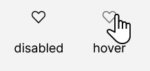
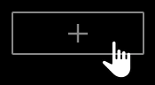

# Welcome to Kim's Sprint 3: Around the U.S.!

This project was designed so that pictures around the U.S. could be added or removed to Jacques' profile and his pictures could be liked.

For this project, I had **2 main goals** coding-wise. First, I learned how to use _Figma_ and replicated this figma desgin (https://www.figma.com/file/ii4xxsJ0ghevUOcssTlHZv/Sprint-3%3A-Around-the-US?node-id=7505%3A2&t=MZEXeVd4sPK5XFhg-0) without a brief of anykind. Second, I learned how to make the page responsive with media queries and different screen sizes without the layout breaking.

Additional items I learned and implemented included grid templates, importing and applying fonts, and buttons.

Some <u>cool</u> features about this are that when you hover over either a heart or the "+" button, the mouse changes like this:
 and .

To see my previous projects or see how I'm doing on future projects, visit my github at: https://github.com/kimyeeeee.

Thanks for reading!
